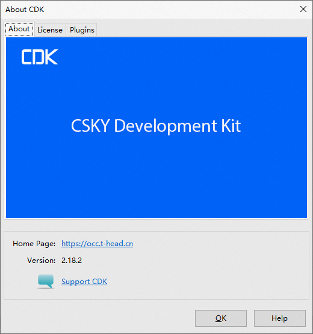
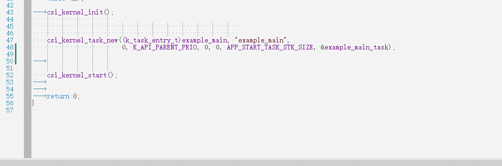
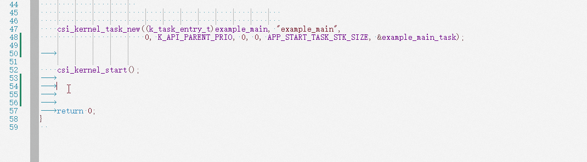
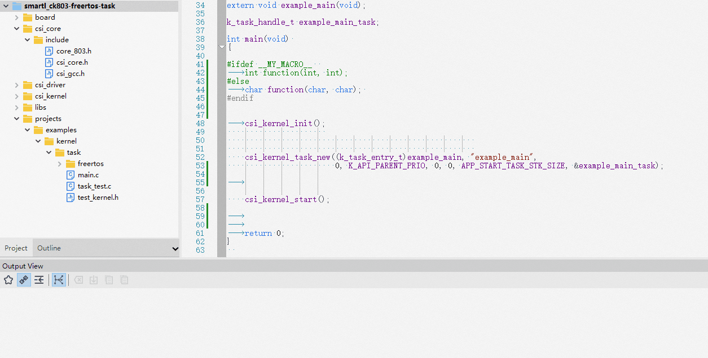
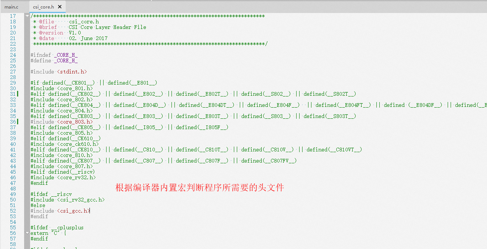
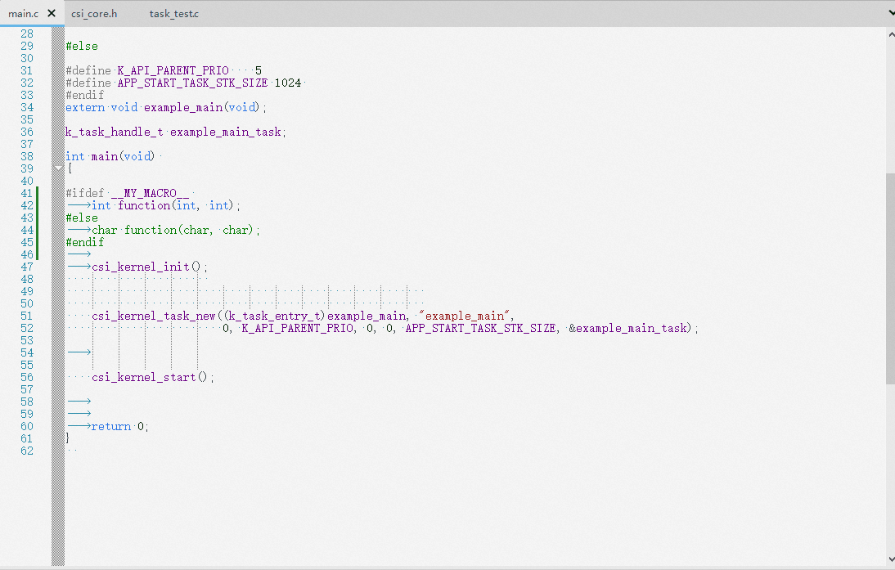
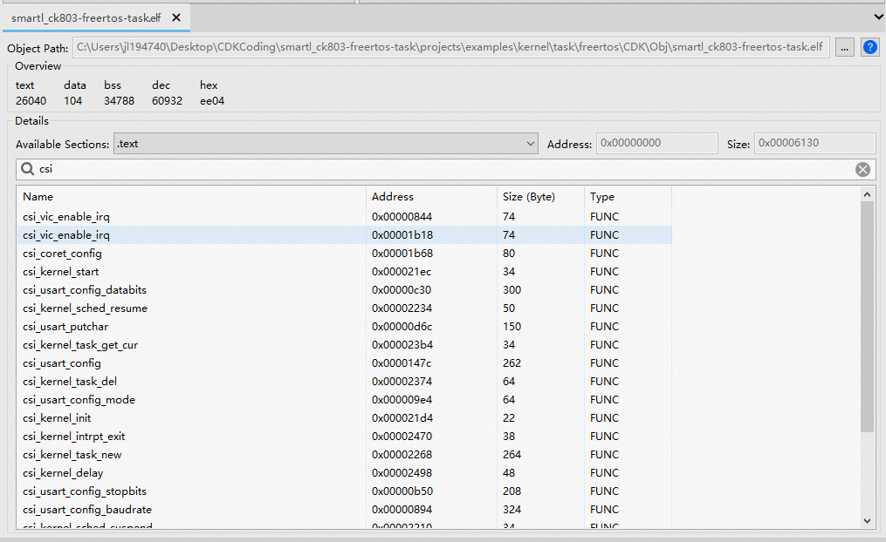
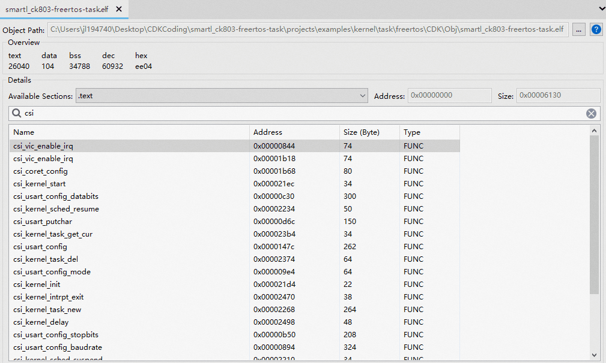
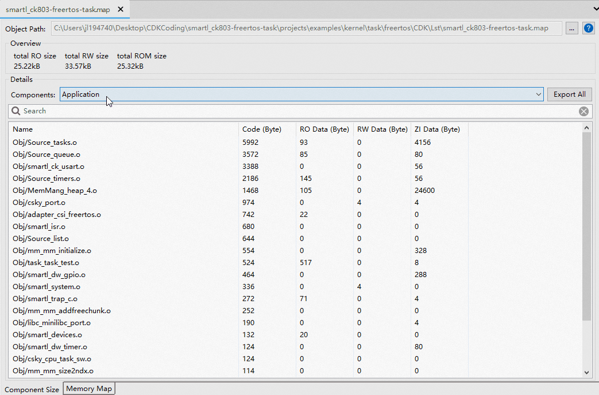
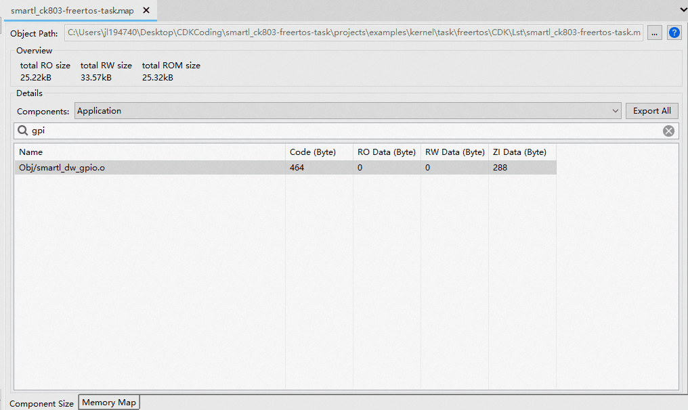

#CDK V2.18.2版本特性介绍

## ！！~ 新版本发布啦 ~！！

[](https://occ.t-head.cn/community/download?id=4119141468164132864)

经过平头哥程序猿们不计头发的加班加点，[CDK V2.18.2](https://occ.t-head.cn/community/download?id=4119141468164132864) 终于得以和开发者见面啦，本次CDK做了很多的改进和bug修复，下面让我们具体看其中的一些吧！

### 代码编写联想功能更加智能
CDK果然放弃了原有ctag对工程代码进行parse的技术方向，采用了行业先进的C/C++ Language Server -- [Clangd](https://clangd.llvm.org/) ，用于解析CDK的project源代码。

通过引入Clangd，开发者在使用CDK进行代码编写时，CDK会更加智能的在用户写代码时，联想出可以使用的代码，开发者只需要选择合适的代码，Tab插入即可。



插入以后，如果需要额外的参数，CDK会给开发者提供insert模式，通过Tab按键，可以快速切换光标位置，与此同时，参数列表也会高亮当前光标所在的位置对应于函数的哪个参数。

### 代码编写新增了insert辅助功能
不仅可以对函数进行插入，还可以快速插入一些C/C++常用的代码块，通过配合Tab按键的使用，让开发者可以在不摸鼠标的情况下完成一些代码的编写。



### 新增了代码灰化功能
在旧版本的CDK中，如果遇到如下代码块：
```text
#ifdef __MY_MACRO__
	int function(int, int);
#else
	char function(char, char);
#endif
```
在旧版本中，CDK无法有效的判断程序真正使用的是int function(int,int)还是char function(char, char)。

在V2.18.2中，CDK不仅可以判断出来程序代码（头文件）中的这些宏定义，还可以把工程配置中的宏定义进行分析，然后把代码中不起作用的部分灰化掉。



不仅仅工程配置中的宏，对于编译工具链的内置宏，CDK同样可以检测到，并对代码相应部分进行灰化处理；



### 代码折叠功能也得到了加强
对于之前版本的CDK，代码折叠以后，切换代码回来，发现折叠的状态会全部消失，这对于代码查看很不友好。

V2.18.2中，我们有效的解决了这个问题，切换代码回来，编辑器的代码折叠状态将不会收到影响。



### 件可以图形化的查看
新版本中，我们对用户反馈晦涩难懂的文件做了可视化处理，目前支持了两类文件的图形化查看
#### Elf文件图形化
Elf文件本身作为二进制文件，没有对应的工具去获取信息的话，很难获取elf文件中的内部信息，CDK提供了Elf文件的一种图形界面。

对于任何编译完成的工程，右击工程节点，点击Open Elf，都会在代码窗口中显示当前工程编译出来的Elf文件信息；



开发者可以查看Elf文件中每个Section中包含的符号信息。

不仅如此，双击某个符号，还会自动跳转到源代码对应的位置，这项功能配合表格大小排序，可以迅速的找到源代码中size比较大的函数。



#### Map文件图形化
针对很多开发者反馈的Map文件内容冗余的问题，CDK也针对Map文件做了图形化的处理工作，只要在工程配置OutputTab中勾选了Linker Map Listing选项，但编译成功以后，右击工程，选择Open Linker Map File选项即可。

对于Map图形化文件，开发者可以对程序的二进制构成做精确的拆分：

1 最终程序的组成分类，以及每个部分包含的目标文件的代码、数据的大小；

2 双击某个目标节点，可以展开对应二进制目标文件的视图，双击视图中的符号，可以定位到源代码的位置；

3 可以将这些数据全部导出到文本文件中；



不仅如此，开发者还可以看到内存视图下的程序的二进制目标文件的组成，这样就可以快速了解对应代码具体被分配到芯片的那块存储区域中了。




### 欢迎试用CDK新版本
其它更新和改进，参见 [ReleaseNote](https://occ-oss-prod.oss-cn-hangzhou.aliyuncs.com/resource//1669967918141/ReleaseNote.txt)
中CDK-Release V2.18.2章节的详细介绍。
欢迎感兴趣的厂商或个人 [点击这里](https://occ.t-head.cn/community/download?id=4119141468164132864) 获取CDK V2.18.2版本下载页。