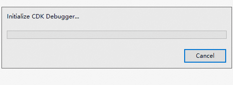
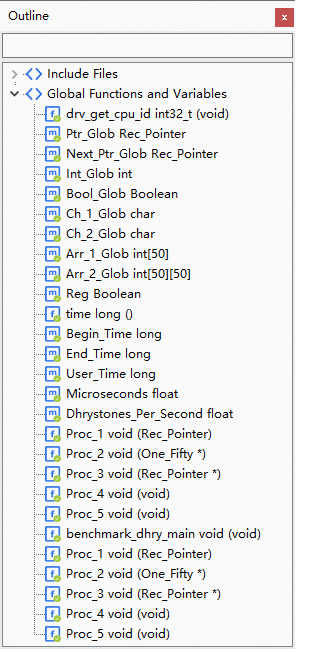
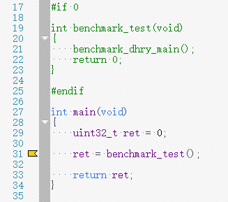
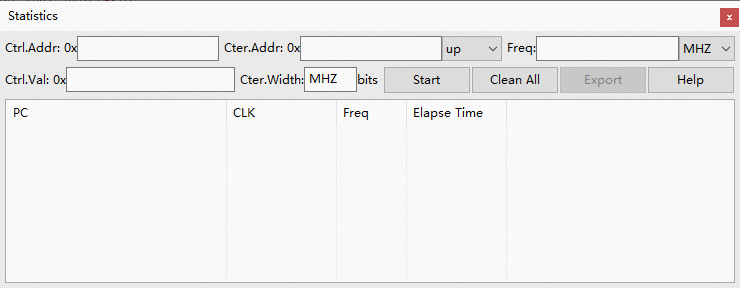

# CDK V2.20版本特性介绍

## ！！~ 亲们，CDK V2.20版本发布啦 ~！！

经过剑池CDK开发程序猿小哥哥们的努力，[CDK V2.20]() 
终于得以和开发者见面啦，本次CDK的更新，不仅对V2.18.2版本的使用反馈做了改进，
还对与一些常用功能做了效率提升，下面我们来了解部分改进吧！

### Flash烧写效率的改进
Flash烧写是CDK调试的重要功能，烧写效率的提升能够显著改善开发者的调试效率，
为此，CDK针对Flash烧写流程，进行了路径优化，让使用T-Head玄铁CPU的Flash烧写速度平均提升30%；
并且，针对Flash烧写进度条信息不准确的反馈，也做了改进，让CDK中的烧写更加准确、流畅；

以下是我们针对V2.18.2和V2.20烧写效率的对比：

| 验证工程名                        | V2.18.2烧写时间 | V2.20烧写时间 | 提升百分比 |
|------------------------------|-------------|-----------|-------|
| CB2201-Rhino                 | 7.4s        | 5.0s      | 32.3% |
| ch2601_PlayerDemo            | 55.3s       | 35.4s     | 36.0% |
| PHY6220_mesh_light_node_demo | 37.6s       | 29.6s     | 21.3% |
| 总计                           | 100s        | 70s       | 30%   |

当然，具体烧写速度还跟具体的硬件相关，
这里以一个典型MCU的烧写进度展示做一个动态对比，方便大家直观感受：

    
    CDK V2.18.2版本烧写进度展示，整体消耗约9s时间；

    
    CDK V2.20版本烧写进度展示，整体消耗约6s时间；

### 代码编写功能的反馈改进
针对小伙伴们在V2.18.2版本中代码编辑试用的反馈，新版本中首先把这些反馈中的一些不稳定的问题做了修改，
包括某些win7下无法使用、打开大文件时工作异常等；

除此以外，新版本还对一些功能做了改进，让代码编写体验更好；

#### Outline窗口显示改进
 

    1 解析的符号和符号的原型显示效果过于混乱，修改了这部分显示效果； 
    2 符号没有排序，本次针对符号排序问题，做了更新；

#### 代码编辑中的更新
 

    1 宏定义的无效代码的显示变为真正的灰化，而不是注释颜色；
    2 静态代码诊断的显示，不会在侧边栏，而是以波浪线的方式提醒具体位置；
    3 新增了文档的代码formatting功能，一键让代码更规整漂亮；

#### 新增了用于代码静态调用链查看的Call Hierarchy窗口

代码查看中遇到任何函数，右击选择Show Call Hierarchy...，即可弹出该函数在整个工程中的调用关系，
通过使用Call Hierarchy 窗口，能够对工程整体的调用关系有一个全局的把握，
帮助开发人员快速了解整个工程的调用关系；

### 芯片管脚可视化配置迭代改进
熟悉CDK的小伙伴们可能知道，芯片管脚可视化配置在CDK很早的版本中就已经存在了，
我们在和合作伙伴适配的时候，遇到了一些适配上不够灵活的问题，在2.20版本中，
我们针对这些反馈，逐一改进，降低芯片管脚图形化配置功能在芯片厂商的适配工作的难度；

    1 管脚显示更新为只显示当前配置功能；
    2 新增管脚Name用户自定义功能；
    3 新增管脚功能数量、类型厂商可配置功能；
    4 外设配置界面新增某个配置对其它配置界面是否有效的功能；

### 其它改进项
除此以外，本次版本对其它功能和界面也做了一些更新和改进；

#### 调试界面的Statistics窗口更新

该窗口，能够很好的借助MCU的计数器来评估MCU某些软件模块的运行时间，在旧版本中，对MCU的计数器限制较大;

新版本中，除了增加了计数器上下计数可配置功能，还解除了计数器的位宽限制，从8bit到64bit可配置；

#### 内存窗口增加数据断点插入入口

针对CDK初学者对于调试的数据断点设置入口找不到的情况，CDK在Memory窗口增加了设置数据断点的入口；
在进行内存查看时，如果有需要，可以随时在Memory窗口的任意位置插入一个数据断点；

#### 增加了Attach to Target的调试启动选项

针对开发者有需要attach的场景，CDK在启动调试入口增加了一个Attach to Target的模式启动调试，
在Attach to Target的方式启动调试时，CDK不会对target目标做任何修改，
只是尝试让target进入调试模式，方便开发人员检查调试目标的第一现场，快速找到错误原因；

#### Map文件视图增加ROM/RAM用量百分比显示
Build完成以后，打开Map视图，增加了各个存储单元用量百分比显示，帮助开发人快速了解整个系统的存储状态；

### 其它问题的修改说明
本次版本同时还修复了一些之前版本存在的问题：

1 修复了硬件观察点超过限制，调试无法正常停止的问题

2 修复了64位CPU调试界面反汇编的边界地址查看导致调试卡死的问题

3 修复了全速运行时插入断点，Breakpoint窗口不更新的问题

4 修复了打开存在较多project的workspace时导致的CDK偶现crash的问题

5 修复了64位CPU调试时Memory窗口滑块无法正常使用的问题

6 修复了64位CPU调试时Memory窗口long类型显示时的位宽错误的问题

7 修复了某些编码情况下导致文件无法保存的问题

8 修复了某些情况下，代码查看无法goto definition/goto declaration的功能

9 修复了CDK打开大文件时，代码查看无法正常使用的问题

10 修复了win7下调试无法正常interrupt的问题

11 修复了win7下代码查看无法使用的问题

12 修复了使用模拟器进行调试时出现的卡死、退出的问题

### 欢迎试用CDK新版本
其它更新和改进，参见 
[ReleaseNote](https://occ-oss-prod.oss-cn-hangzhou.aliyuncs.com/resource//1669967918141/ReleaseNote.txt)
中CDK-Release V2.20章节的详细介绍。
欢迎感兴趣的厂商或个人 [点击这里](https://occ.t-head.cn/community/download?id=4119141468164132864) 
获取CDK V2.20版本下载页。